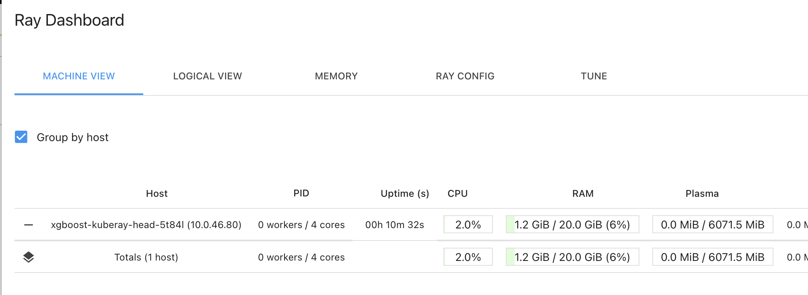
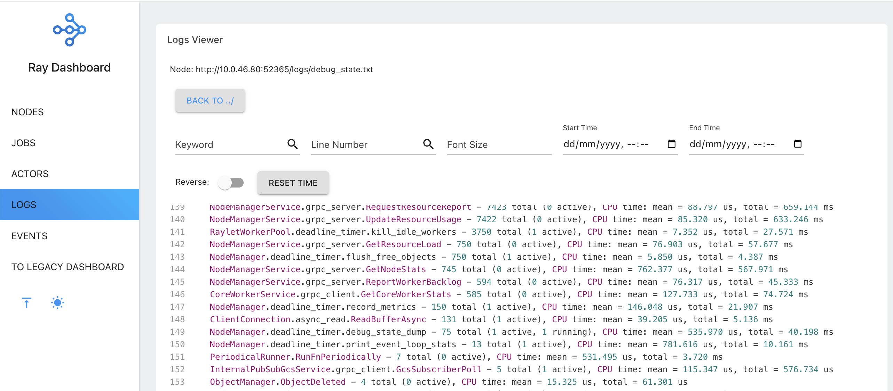

# Ray on EKS Demo (Adapted and Working Version)


⚙️ What is Ray?
Ray is a distributed computing framework that makes it easy to:

* Run Python code in parallel.
* Scale Python and ML workloads from a laptop to a large cluster.
* Build distributed applications like hyperparameter tuning, reinforcement learning, model training, and data processing.

Website: https://ray.io


🧠 Why is Ray used in ML/AI?

Because training models and processing large datasets can be slow and resource-intensive, Ray helps by:

* Running tasks in parallel.
* Managing resources (CPU/GPU) efficiently.
* Providing ML-specific libraries out of the box.


This repository contains a working adaptation of the official Ray on EKS demo. The original example had some issues that prevented it from running out of the box. I rebuilt and tailored the deployment to work seamlessly on a personal AWS EKS cluster using Terraform, Helm, and AWS CLI.

This project demonstrates how to:

Deploy a Ray cluster on EKS with auto-scaling support

Use Ray Dashboard to monitor task execution

Run a simple parallel task using Ray to test the setup

While the core concept is based on Ray’s original example, the infrastructure and deployment workflow have been reworked to ensure functionality and ease of use.


## Highlights

* Fully reproducible Ray cluster deployment on EKS
* Uses Terraform to provision the cluster
* Configured with Helm charts for Ray and Kubernetes dashboard
* Deploys autoscaler + head node + worker nodes
* Includes a basic Ray task example for testing the setup
* Visual monitoring via the Ray Dashboard


## Tech Stack

* Ray
* AWS EKS
* Terraform
* Helm
* kubectl / AWS CLI
* Kubernetes Dashboard

## PoC/Demo

All the code is based on  https://github.com/awslabs/data-on-eks/tree/main/ai-ml/ray/

When penforming the first installation I found a number of issues in relation with the versions and Sizing so the cluster didn't work.

This is my own test-drive of the original code in a working format based on my last testing.

This demo is using AWS EKS version: `3.12`

This demo has to pieces of Terraform code:

1. Installs VPC/EKS cluster with all it's dependencies
2. The examples directory where you install and test `xgboost`


The old document describing the process is in here: 

https://awslabs.github.io/data-on-eks/docs/blueprints/ai-ml/ray


### VPC/EKS

To install VPC/EKS simply execute the `install.sh` script

### xgboost

To install `xgboost` in the `examples/xgboost/` directory do the following:

```
terraform init
terraform plan
terraform apply
kubectl port-forward service/xgboost-kuberay-head-svc -n xgboost 8265:8265

```
And then execute the job after installing the ray python dependencies

```
export RAY_ADDRESS="http://localhost:8265"
python job/xgboost_submit.py
```

Remember to install the relevant Python dependencies for this scenario

```
pip install 'ray[default]'
```

Make sure the job uses the correct Ray head node address, which you can get from:

```
kubectl get svc
```

## Ray Dasboard

* Ray Dasboard Machine View


* Ray Dasboard Logs




## To-Do

* Makefile and remote s3 bucket/DynamoDB for statefile/locks


## Why This Project

I created this adaptation because the official demo did not run successfully with a fresh EKS setup. This project reflects real troubleshooting and end-to-end deployment of a distributed computing platform. It’s useful for infrastructure engineers and MLOps practitioners exploring scalable workloads on Kubernetes.

